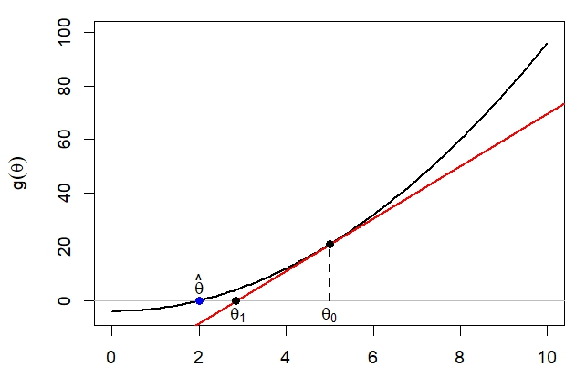
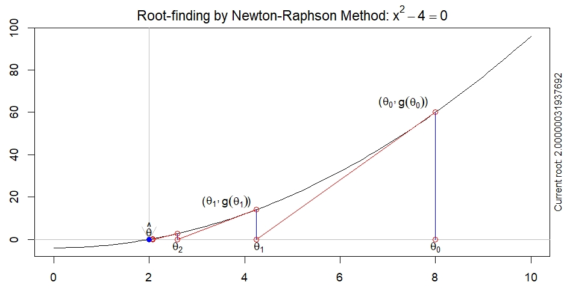
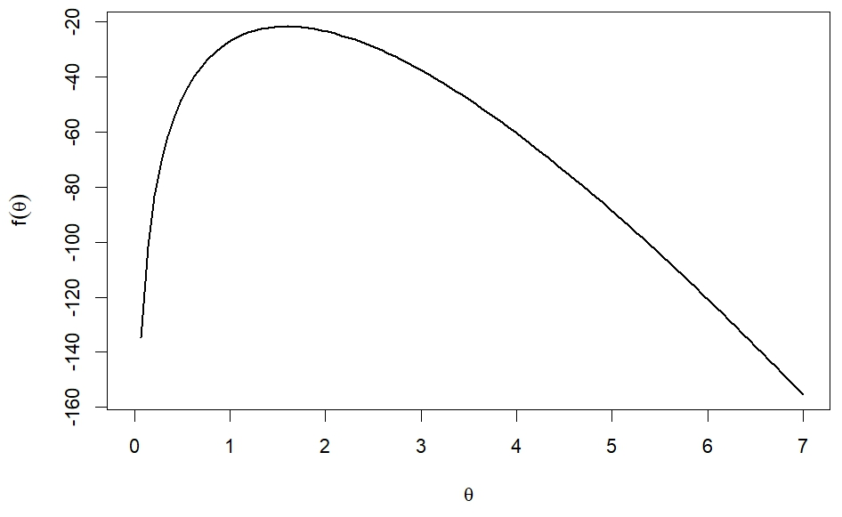

# Otimização Numérica

## Método de Newton

**Propósito:** maximizar ou minimizar a função  $f(\theta)$ ou, de forma equivalente, encontrar a raiz da equação $g(\theta)=0$, em que $g(\theta)=f'(\theta)$.

Considere um valor inicial $\theta_0$, próximo de $\hat{\theta}$. A expansão de Taylor de $g(\theta)$ em torno de $\theta_0$ é:

$$
g(\theta)
=
g(\theta_0)
+
g'(\theta_0)(\theta - \theta_0)
+
\frac{g''(\theta_0)(\theta-\theta_0)^2}{2!}
+
\cdots
$$

Para $|\theta - \theta_0|$ pequeno, desprezamos termos quadráticos ou superiores:

$$
g(\theta) \approx g(\theta_0) + g'(\theta_0)(\theta - \theta_0).
$$


Estamos aproximando $g(\theta)$ por uma função linear de $\theta$ que tem o mesmo valor e inclinação de $g(\theta)$ no ponto $\theta=\theta_0$.


{width=80%}


O método de Newton trata com a equação da reta que passa pelo ponto $(\theta_i,g(\theta_i))$ e é tangente à curva nesse ponto:

$$g(\theta)-g(\theta_i)=g'(\theta_i)(\theta-\theta_i),\quad i=0,1,2,\ldots$$

em que $g'(\theta_i)$ é a inclinação da reta (derivada). Essa reta passa pelo ponto $(\theta_{i+1},0)$. Assim, 

$$\begin{align*}
0-g(\theta_i)& = & g'(\theta_i)(\theta_{i+1}-\theta_i) \Rightarrow\\
\theta_{i+1} & = & \theta_i - \dfrac{g(\theta_i)}{g'(\theta_i)}
\end{align*}$$

{width=80%}

Note que $\theta_0$ é apenas uma "estimativa qualquer" para a raiz $\hat\theta$ da equação $g(\theta)$. A proposta do método é atualizar esse valor proposto da seguinte forma:

- determinar $\theta_1=\theta_0 - \dfrac{g(\theta_0)}{g'(\theta_0)}$ 
- determinar $\theta_2=\theta_1 - \dfrac{g(\theta_1)}{g'(\theta_1)}$
- repetir esse processo até que $\theta_{i+1}\approx\theta_i$
- $\theta_i$ será a raiz da equação.

O método de Newton está implementado na função `maxNR` do pacote `maxLik` do programa `R`. 

**Exemplo:** Seja $f(\theta) = 100\log(\theta)-50\theta -50\log(1-\exp(-\theta))$.

{width=80%}

Determinando o ponto de máximo da função $f(\theta):$

```{r}
#| message: false
#| warning: false

library(maxLik)
		
f <- function(u) (100*log(u) - 50*u-50*log(1-exp(-u)))


maxNR(f, star = 1)$estimate # 1.593624

maxNR(f, star = 1)$maximum  # -21.72331
```

Outras funções relacionadas a otimização:

1. `optimize`: determinar o ponto de máximo (mínimo) da função $f(\theta)$:

```{r}
f <- function(u) (100*log(u) - 50*u-50*log(1-exp(-u)))
optimize(f, lower = 0, upper = 5, maximum = TRUE)
```

2. `uniroot`: determinar a raiz da equação $\dfrac{\partial{f}}{\partial\theta}=0$.

```{r}
f <- function(u) 100*(1/u)-50-50*(exp(-u)/(1-exp(-u)))
uniroot(f, interval = c(0.001, 5))
```


A função `D` é usada para a obtenção de *derivadas*.

```{r}
# Exemplo 1
f <- expression(x^4, "x")	
d1 <- D(f, "x");d1  # primeira derivada
d2 <- D(d1, "x");d2 # segunda derivada
```


```{r}
# Exemplo 2	
f  <- expression(100*log(u) - 50*u-50*log(1-exp(-u)))
d1 <- D(f, "u");d1  # primeira derivada
d2 <- D(d1, "u");d2 # segunda derivada
```


```{r}
# Exemplo 3: função para derivadas de ordem n
Dn <- function(expressao, variavel, ordem = 1) {
  if(ordem < 1) stop("ordem deve ser >= 1")
  else if(ordem == 1) D(expressao, variavel)
  else Dn(D(expressao, variavel), variavel, ordem - 1)
}

Dn(expression(x^4), "x", 1)
Dn(expression(x^4), "x", 2)
Dn(expression(x^4), "x", 3)
```

```{r}
# Exemplo 4: implementando o método de Newton
f  <- function(u) 100*log(u)-50*u-50*log(1-exp(-u))
d1 <- function(u) (100/u)-50-(50*exp(-u))/(1-exp(-u))
d2 <- function(u) -(100/u^2)-(50*exp(u))/(exp(u)-1)^2

u <- 1 # estimativa/chute inicial 
dif <- 1; i <- 2; f.max <- 0
while (dif > 0.00001) {
  u[i] <- u[i-1] - d1(u[i-1])/d2(u[i-1])
  dif <- abs(u[i] - u[i-1])
  f.max <- f(u[i])
  i <- i + 1
}

u[i-1]

f.max
```


Considere que $\hat\theta$, o estimador de máxima verossimilhança do parâmetro $\theta$, pode ser obtido de $U(\theta)=0$, ou seja, $\hat\theta$ é a raiz dessa equação. Portanto, o procedimento de Newton se estabelece fazendo $g(\theta)=U(\theta)$ e  $g'(\theta)=U'(\theta)=-I(\theta)$ e é dado por

$$\theta_{i+1}  =  \theta_i + \dfrac{U(\theta_i)}{I(\theta_i)},\quad i=0,1,2,\ldots $$
Quando $\theta_{i+1}\approx\theta_i$, o estimador de máxima verossimilhança será  $\hat\theta=\theta_{i}$.

Observações:


1. Com bons chutes iniciais, 3 ou 4 iterações são suficientes para a convergência. Isso se deve ao fato de que para grandes amostras, $U(\theta)$ é próxima da linearidade em $\theta$.
2. Se $U(\theta)$ é exatamente linear em $\theta$, o método produz $\hat\theta$ em uma única iteração.
3. Se $U(\theta)=0$ tem mais de uma raiz, o método não necessariamente converge para a raiz desejada. Dificuldades também surgem se o máximo ocorre no limite ou próximo a um limite do espaço paramétrico. Sugere-se examinar o gráfico de $l(\theta)$ antes de aplicar o método de Newton.


